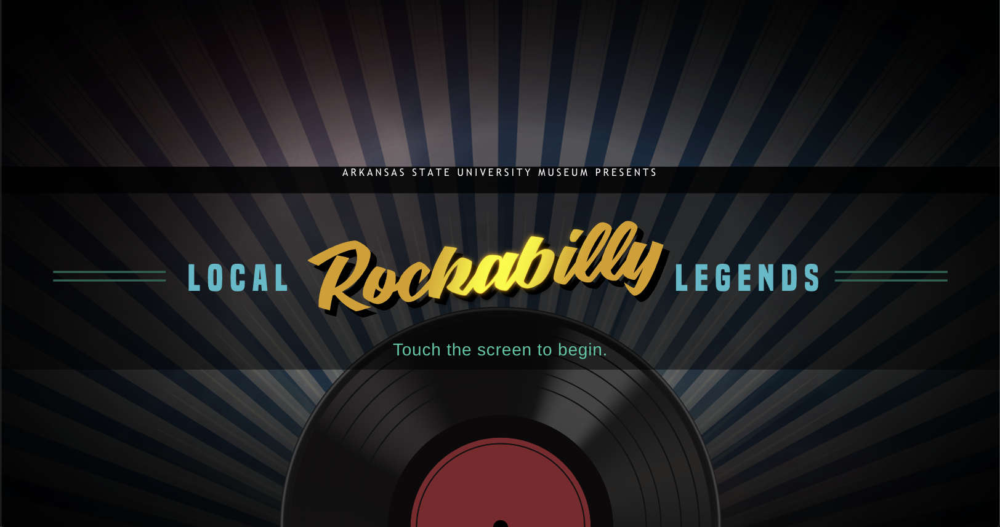

# Rockabilly


## Project Overview

This project is for a hands-on Museum exhibit kiosk that plays snippets of the early pioneers of the Rockabilly style.

## Setting up the project

## Install yarn

```shell
brew install yarn
```

## Install the dependencies

from within the root directory of the project run:

```shell
yarn install
```

## Configure chrome for audio

We have to setup our browser like this to allow sounds to playback without user interaction
<https://stackoverflow.com/questions/49930680/how-to-handle-uncaught-in-promise-domexception-play-failed-because-the-use>

## startup the project

yarn start

## Project structure

```javascript
/src/components: shared components can be reused across other projects
/src/containers: Container components are bound to specific animations and data files
/public/: Images and sound files are loaded from here (instead of being webpacked so that we can reference the path in the data csv file)
/src/data/LocalLegends.json: lists all of the rockabilly informatino we are displaying (it is being generated from a csv file)
```

## Production build and server

```yarn build
yarn global add serve
yarn serve -s build
```

## Setting up scheduled tasks on kiosk

Start up the Task Scheduler on Windows
Import the autostartBrowser.xml and autostartServer.xml
